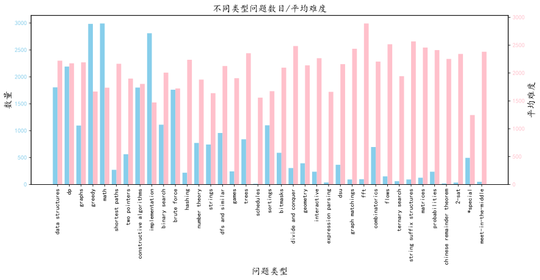
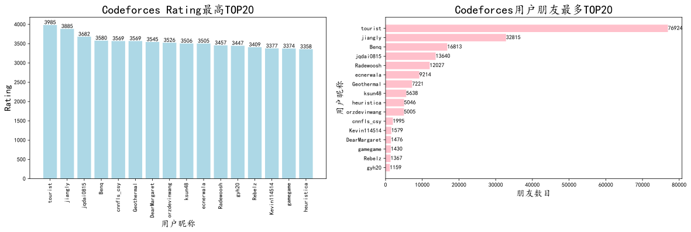
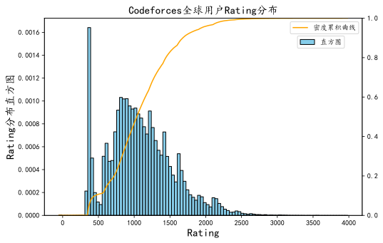
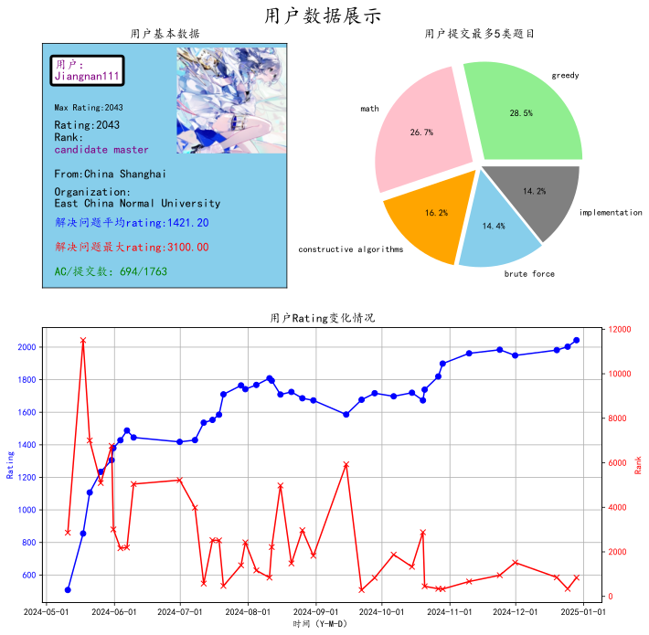
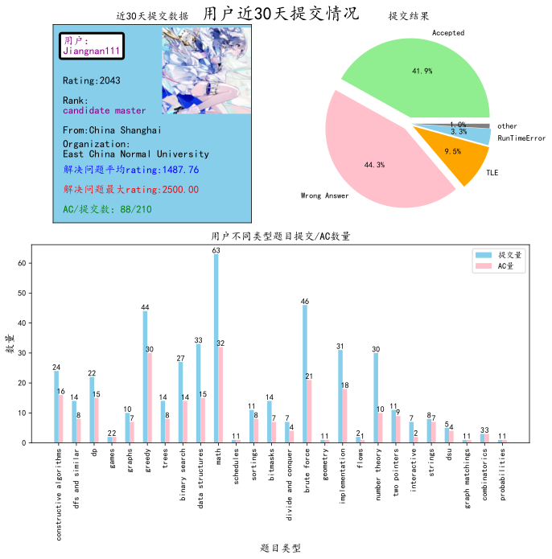
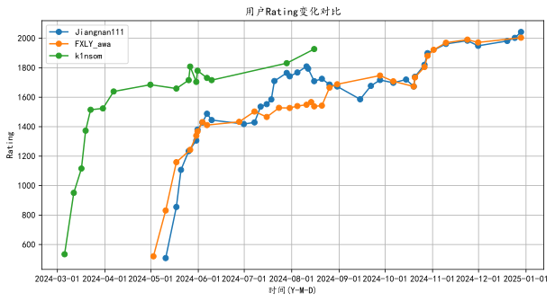
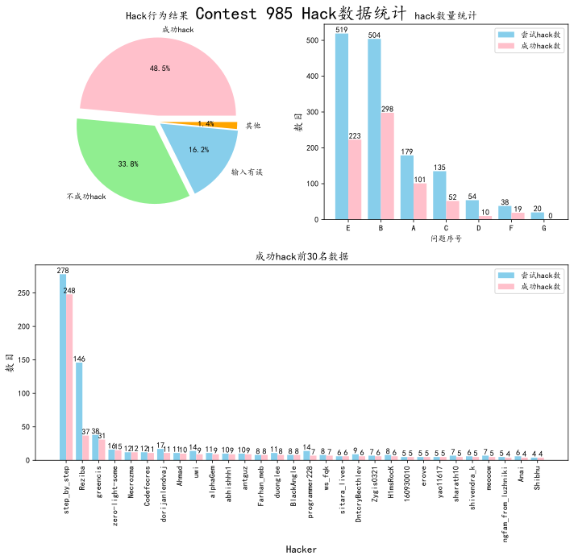
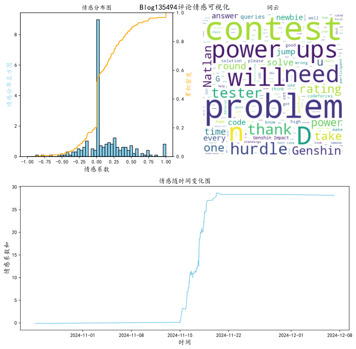

## Codeforces 数据可视化分析报告

### 一、引言
Codeforces 作为全球知名的在线编程竞赛平台，吸引了众多编程爱好者和专业选手参与。本报告旨在通过对 Codeforces 平台数据的可视化分析，深入了解平台的问题集、用户群体以及竞赛相关信息，为参赛者、教育者和平台管理者提供有价值的参考。


```python
import matplotlib.pyplot as plt
%matplotlib inline
%config InlineBackend.figure_format = 'svg'
```

### 二、公共数据可视化

##### （一）Codeforces 问题集概况可视化


```python
from AllProblemInfoShow import getProData,showAllProblemRatingDis,showInfoProblemLabels
#获取数据
getProData()
```

    问题集数据获取成功
    


```python
#展示问题难度分布
plt.figure(figsize=(10,5))
ax = plt.subplot(111)
showAllProblemRatingDis(ax)
```


    

    


- 通过对问题难度系数的统计和可视化，我们清晰地看到难度为 800 的问题数量最多，形成了一个明显的峰值。这表明在 Codeforces 平台上，对于初涉编程竞赛的选手来说，有较多适合他们练习和提升的基础题目。而其他问题的分布类似于二次函数，中等难度的题目数量相对较多，这体现了平台问题难度设置的梯度性，能够满足不同水平选手的需求，从新手到进阶选手都能找到适合自己挑战的题目。  
- 这种难度分布模式有助于吸引更多的用户参与，新手可以从低难度题目入手，逐步积累经验和技能，而有一定基础的选手则可以在中等难度题目中磨练自己的算法和编程能力，向更高难度挑战。


```python
#展示不同问题标签
plt.figure(figsize=(14,5))
ax = plt.subplot(111)
showInfoProblemLabels(ax)
```


    

    


- 对不同类型问题的数量和平均难度进行可视化展示后，我们发现数量最多的几种类型如 math、greedy、implementation，它们的平均难度并不高。这意味着这些类型的题目是平台上较为常见的基础题型，对于培养选手的基本编程思维和算法应用能力具有重要作用。例如，math 类型的题目可以帮助选手巩固数学基础，提升逻辑推理能力；greedy 类型的题目则有助于培养选手的贪心策略思维。  
- 而平均难度较高的几种问题，如 fft、flows、2 - set 等，数量相对较少。这些难题通常需要更深入的算法知识和复杂的编程技巧，是为高水平选手准备的挑战。它们的存在提升了平台的竞赛层次，吸引了顶尖选手在平台上展示自己的实力。总体而言，Codeforces 平台的题目以中等题和简单题为主，难题数量较少，这种分布符合大多数用户的需求，使得平台具有广泛的用户基础。

##### （二）Codeforces 全体用户概况可视化


```python
from AllUserInfoShow import getAllUserInfo,showAllUserCountry,showAllUserRatingDist,showTop20HighRating,showTop20MostFriend
#获取数据
getAllUserInfo()#这里暂时不使用因为codeforces获取全部用户的数据的API出问题了，所以我用了我前段时间获取的数据
```

    所有用户数据获取成功
    


```python
#展示用户所属国家
plt.figure(figsize=(14,5))
ax = plt.subplot(111)
showAllUserCountry(ax)
```


    

    


- 从用户所属国家的可视化数据中可以看出，印度（India）、孟加拉国（Bangladesh）和中国（China）是用户数量最多的国家。印度和孟加拉国拥有庞大的编程爱好者群体，可能与这两个国家对计算机科学教育的重视以及不断增长的科技产业需求有关。中国作为全球人口大国和科技发展迅速的国家，也有大量用户活跃在 Codeforces 平台上。用户数量超过 1000 的国家仅有 6 个，其他国家用户数量相对较少，这反映出平台用户在地域分布上存在一定的集中性，但也吸引了来自全球不同地区的用户，具有一定的国际影响力。  
- 了解用户的地域分布有助于平台根据不同地区用户的特点和需求，开展针对性的推广活动，如举办地区性竞赛、提供多语言支持等，进一步提升平台在全球范围内的知名度和用户参与度。


```python
#展示rating和朋友数量最多的20为用户
fig = plt.figure(figsize=(20,5))
ax = plt.subplot(121)
ax1 = plt.subplot(122)
showTop20HighRating(ax)
showTop20MostFriend(ax1)
fig.savefig("./OutPut/MostRatingAndFriend.svg")
```


    

    


- 在 Rating 最高的 TOP20 用户和朋友数量最多的 TOP20 用户中，我们发现一个显著的趋势：通常 Rating 越高的用户，其朋友数目也越多。以 tourist 为例，他在两个榜单中均名列前茅。这可能是因为在 Codeforces 平台上，高 Rating 用户往往具有较高的编程水平和竞赛经验，他们在社区中更受关注，与其他用户交流和互动的机会也更多，从而结交了更多的朋友。这种现象也反映出平台社区中存在一定的社交层级，高 Rating 用户在社区中扮演着重要的角色，他们的经验分享和互动对其他用户具有积极的影响。  
- 对于平台管理者来说，可以利用这一特点，鼓励高 Rating 用户积极参与社区建设，如举办线上讲座、分享解题思路等，促进知识的传播和用户之间的交流合作。


```python
#展示rating分布
plt.figure(figsize=(8,5))
ax = plt.subplot(111)
showAllUserRatingDist(ax)
```


    

    


- 对用户 Rating 分布的可视化分析显示，其分布类似于正态分布，但在 0 - 500 分段存在一定的反常情况。我们推测这可能是由于部分用户注册账号后仅参加了一场比赛便不再参与，导致该分段数据出现波动。整体来看，约 80% 的用户 Rating 在 1500 以下，90% 的用户 Rating 在 1900 以下，这表明平台上大部分用户处于中等及以下水平，高水平用户相对较少。这种分布情况为平台的竞赛分级和题目难度设置提供了参考依据，例如，可以针对不同 Rating 区间的用户举办相应难度级别的竞赛，以提高用户的参与度和竞赛体验。

### 三、用户数据可视化

##### （一）用户基本数据可视化
以用户 “Jiangnan111” 为例，我们展示了其详细的基本数据。


```python
from UserInfoDisplay import ShowInfo
username = 'Jiangnan111' #需要可视化的用户
ShowInfo(username)
```

    用户Jiangnan111提交数据获取成功
    用户 Jiangnan111 基本数据获取成功
    用户头像获取成功
    用户 Jiangnan111 Rating数据获取成功
    


    

    


1. 个人信息与刷题概况：  
- 该用户的基本信息包括用户名、来自中国上海、所属组织为华东师范大学等。其 Max Rating 达到 2043，当前 Rating 也为 2043，排名为 candidate master。在刷题情况方面，解决问题的平均 rating 为 1418.71，解决问题最大 rating 为 3100.00，AC / 提交数为 688/1757。这些数据反映了用户的编程能力和竞赛表现，从平均 rating 可以看出用户在解决问题时的整体难度水平，而最大 rating 则显示了其在某些高难度题目上的突破能力。
2. 常刷题目类型：  
- 用户刷得最多的五类题目分别为 math（28.3%）、greedy（26.6%）、implementation（14.4%）、constructive algorithms（14.3%）和 brute force（16.3%）。其中，math 和 greedy 类型的题目占比较高，这表明该用户在数学思维和贪心策略方面有较强的兴趣和能力，可能在相关类型的题目上花费了较多时间进行练习和研究。对于平台而言，了解用户常刷题目类型有助于为用户提供更个性化的推荐题目和学习资源，帮助用户进一步提升在擅长领域的能力。
3. Rating 变化趋势：  
- 用户 Jiangnan111 的 Rating 变化曲线类似于对数函数。在早期阶段，Rating 可能增长较快，随着水平的提高，增长速度逐渐放缓。这是因为在编程竞赛中，随着用户能力的提升，进一步提高 Rating 需要克服更大的挑战，需要更深入的学习和更高难度题目的突破。这种变化趋势对于其他用户具有一定的参考价值，他们可以根据类似的曲线了解自己在平台上的成长路径和发展方向，合理规划学习和竞赛策略。

##### （二）用户最近提交数据可视化


```python
username = "Jiangnan111"
from UserSubmissionInfo import ShowSubmission
ShowSubmission(username,30)#第二个参数表示展示多久的数据
```

    用户Jiangnan111提交数据获取成功
    用户 Jiangnan111 基本数据获取成功
    用户头像获取成功
    


    

    


1. 提交状态分布：  
- 对于用户 Jiangnan111 近 30 天的提交数据，提交结果主要集中在 accepted（40.3%）和 wrong answer（46.2%）。这表明用户在解题过程中虽然有一定的正确率，但仍有较大的提升空间。Accepted 比例反映了用户在一定时间内成功解决问题的能力，而较高的 Wrong Answer 比例则提示用户需要对错误原因进行深入分析，可能是算法理解不透彻、边界条件处理不当或编程细节错误等。通过针对性地改进这些问题，用户可以提高解题的准确性。
2. 不同类型题目提交与 AC 数量：  
- 在不同类型题目的提交中，math 和 greedy 类型的题目提交量相对较高，这与用户常刷题目类型相符合，进一步验证了用户对这两类题目的偏好。同时，观察 AC 数量可以发现用户在不同类型题目上的掌握程度差异，对于提交量高但 AC 数量相对较低的题目类型，用户需要加强练习和总结，提高解题效率和正确性。

##### （三）多用户 Rating 比较
通过对用户 “Jiangnan111”、“FXLY_awa” 和 “k1nsom” 的 Rating 变化对比，我们可以清晰地看到不同用户的 Rating 变化趋势。


```python
#多用户rating比较
from MultiUserRatingCom import showAllUserRating
userNameArray = ['Jiangnan111','FXLY_awa','k1nsom']#填入要比较的昵称
showAllUserRating(userNameArray)
```

    用户 Jiangnan111 Rating数据获取完成
    用户 FXLY_awa Rating数据获取完成
    用户 k1nsom Rating数据获取完成
    


    

    


1. 个体趋势分析：  
- 每个用户的 Rating 曲线都呈现出独特的变化模式。例如，Jiangnan111 的 Rating 曲线在一定时间段内可能呈现稳定上升或波动上升的趋势，反映了其在该时期内的学习和竞赛状态。FXLY_awa 和 k1nsom 的曲线也各自反映了他们的能力发展过程，可能存在快速提升、平台期或偶尔下降等不同情况。这些变化趋势与用户的学习投入、竞赛经验积累以及应对不同难度题目的能力密切相关。
2. 用户间对比意义：
- 对多用户 Rating 进行对比具有重要意义。它可以帮助用户发现自己与其他选手的差距和优势，例如，如果一个用户发现自己的 Rating 增长速度明显慢于其他用户，可能需要反思自己的学习方法和竞赛策略。同时，对于教练和教育者来说，可以根据不同用户的 Rating 变化趋势，为学生提供个性化的指导和建议，帮助他们更好地发展编程能力。对于平台管理者，多用户 Rating 对比数据可以用于评估平台的竞赛公平性和难度设置合理性，以便进行优化调整。

### 四、非用户数据可视化

##### （一）竞赛 Hack 数据可视化


```python
from showHack import showHackOfContest
showHackOfContest(985)#展示id为985的竞赛的hack数据
```

    Contest 985 hack数据获取成功
    


    

    


1. Hack 行为结果统计：  
- 在竞赛 985 的 Hack 数据中，48.5% 的 Hack 行为成功找到了别人代码的漏洞，这表明在竞赛中，相当一部分选手具备较强的代码审查能力，能够发现其他选手代码中的潜在问题。同时，16.2% 的 Hack 行为因输入样例有误而失败，这提示选手在进行 Hack 时需要更加仔细地准备测试数据，确保 Hack 的有效性。其他不成功的 Hack 原因可能包括对题目理解不准确、Hack 方法不当等。
成功的 Hack 不仅可以为自己赢得额外的分数，还能帮助其他选手发现并纠正代码中的错误，提高整个竞赛的质量。因此，平台可以鼓励选手积极参与 Hack 环节，提供相关的培训和指导，提高选手的 Hack 技能。
2. 不同问题的 Hack 情况：  
- 对于竞赛 985 中的不同问题，B 题是 Hack 成功最多的题目。这意味着 B 题在代码实现上可能存在较多容易被忽视的细节或边界条件，导致很多选手的代码在该题上存在漏洞。通过分析 B 题的 Hack 数据，选手可以学习到在处理类似问题时需要注意的关键点，提高自己的编程严谨性。对于竞赛组织者来说，可以根据不同问题的 Hack 情况，对题目进行评估和改进，避免在后续竞赛中出现类似问题。
3. Hack 成功数量最多的前 30 名用户：  
- 在 Hack 成功数量最多的前 30 名用户中，昵称 step_by_step 的用户以断层式的数量领先于其他用户。该用户在 Hack 方面的出色表现可能源于其对算法和代码的深入理解、丰富的竞赛经验以及敏锐的洞察力。平台可以对这些优秀的 Hack 选手进行表彰和经验分享，激励更多用户提高自己的 Hack 能力，同时也可以邀请他们参与平台的竞赛规则制定和题目审核等工作，以提升平台竞赛的专业性和公平性。


```python
from showHack import showHackData
#展示用户hack行为
d=showHackData(888)#竞赛id为888的竞赛的hack数据
```

    Contest 888 hack数据获取成功
    

- 用浏览器打开OutPut中的html文件，我们可以直观地看到hack行为，以及那些人hack数目多。

##### （二）Codeforces 博客评论情感分析可视化


```python
from BlogCommentEmotionAna import commentEmotionAna
#传入博客id，生成可视化图像
commentEmotionAna(135494)
```

    Blog 135494 评论数据获取成功
    


    

    


1. 情感系数分布图：  
- 对博客 135494 评论的情感系数分布进行分析，我们发现大多数评论为中性评论，分布在 0 附近。这表明用户在评论博客时，态度相对客观，主要以提供信息、讨论问题为主。而分布在 0 两侧的评论，积极和消极情感相对较少，极端评论更是罕见。这种情感分布情况反映了平台用户在交流互动中的理性和成熟，有助于营造一个和谐、积极的社区氛围。
平台可以根据情感系数分布情况，对用户评论进行分类管理，对于积极评论可以给予更多的展示和推荐，对于消极评论可以及时进行引导和处理，避免不良情绪的传播。
2. 评论词云：  
- 评论词云中出现最多的词汇有 problem、contest 等，这与博客的主题（介绍一场比赛）密切相关。这说明用户在评论时主要围绕博客的核心内容展开，关注比赛中的问题、竞赛过程和结果等方面。此外，还出现了一些如 “answer”“power” 等词汇，可能表示用户在讨论问题的答案和竞赛中的能力表现。通过词云分析，平台可以更好地了解用户关注的焦点，为博客内容创作和社区话题引导提供参考。
3. 情感随时间变化图：  
- 从情感随时间的变化图中可以看出，博客 135494 的评论走势整体向着积极的方向移动。这可能是由于随着时间的推移，更多用户参与讨论，积极的观点逐渐占据主导，或者是博主对用户评论进行了积极的回应和引导，促进了良好氛围的形成。这种情感变化趋势对于博客作者和平台管理者来说是一个积极的信号，表明博客内容得到了用户的认可和积极反馈，同时也为今后的博客创作和社区管理提供了经验借鉴，鼓励更多优质内容的产生和积极互动的开展。

### 五、总结

- 通过对 Codeforces 平台的问题集、用户概况、用户个人数据、竞赛 Hack 数据以及博客评论等多方面数据的可视化分析，我们全面深入地了解了平台的特点和用户行为模式。平台在问题难度设置上具有合理的梯度，能够满足不同层次用户的需求；用户群体分布呈现一定的地域集中性和社交层级性；用户在平台上的活动和表现为个人能力提升、竞赛组织优化以及社区建设提供了重要参考。未来，平台可以根据这些分析结果，进一步优化题目推荐算法、改进竞赛规则、加强社区互动功能，为用户提供更好的服务和体验，推动编程竞赛文化的发展。
