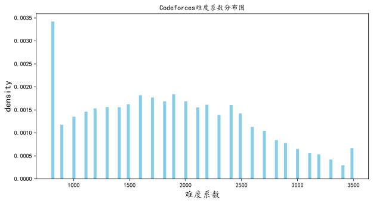
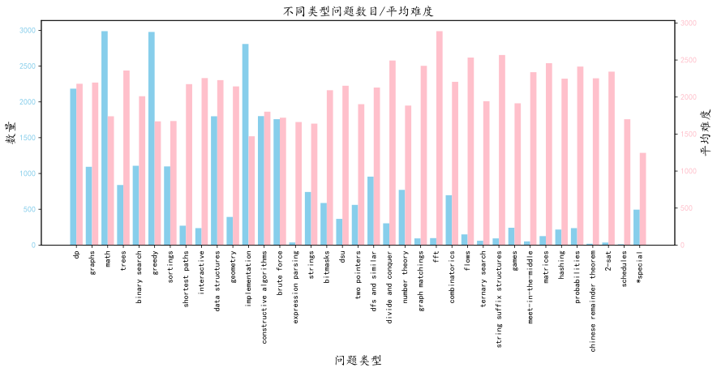
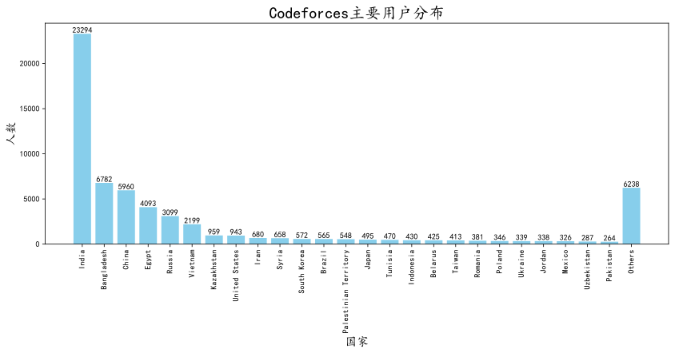
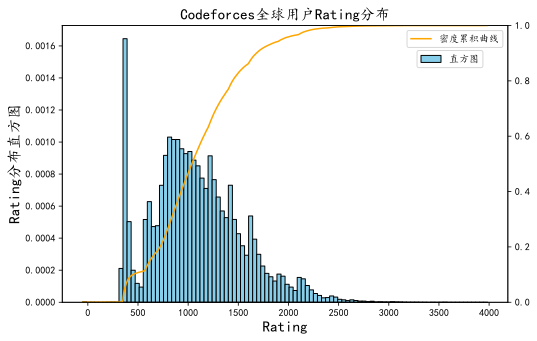
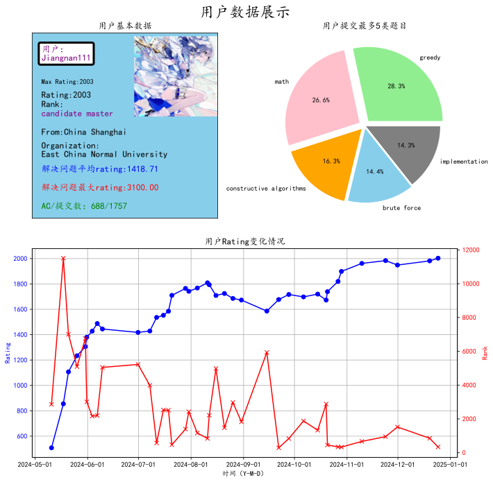
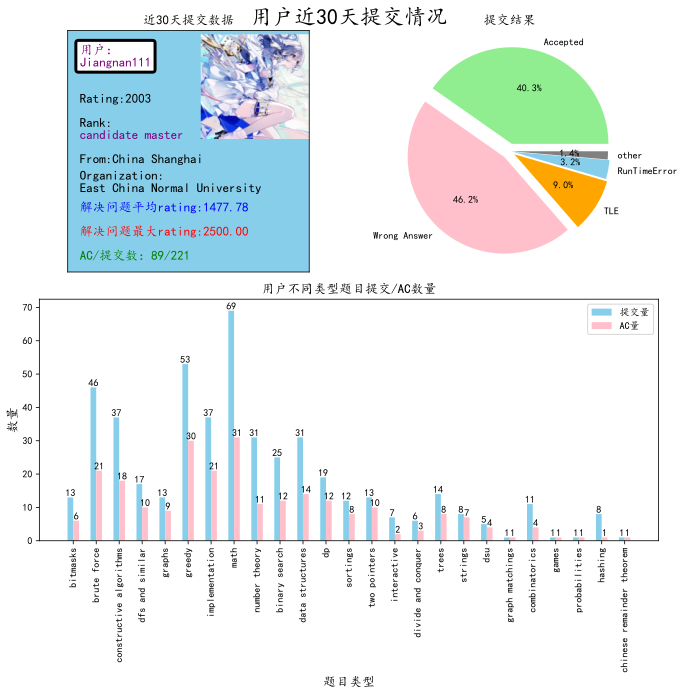
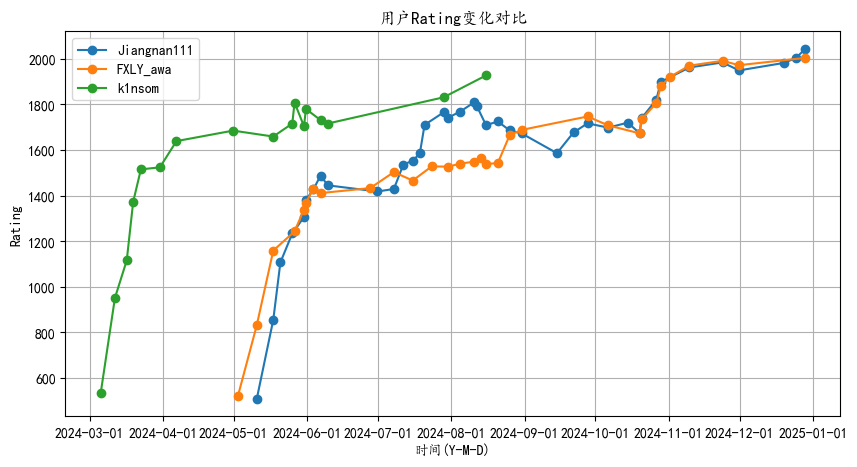
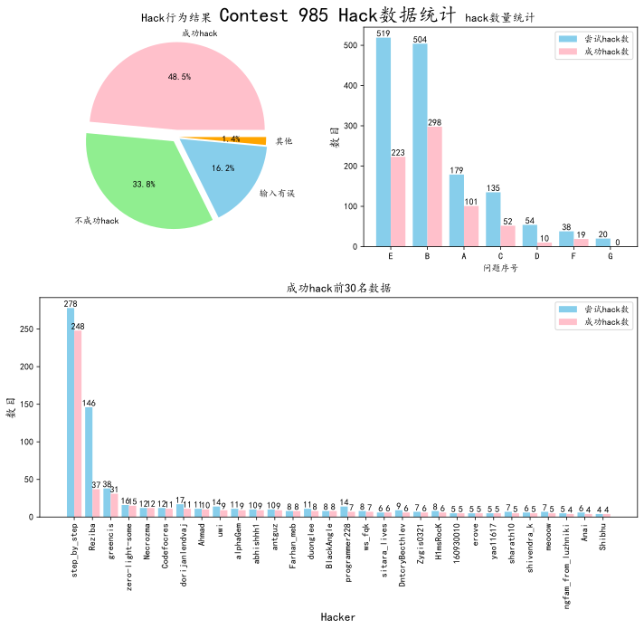
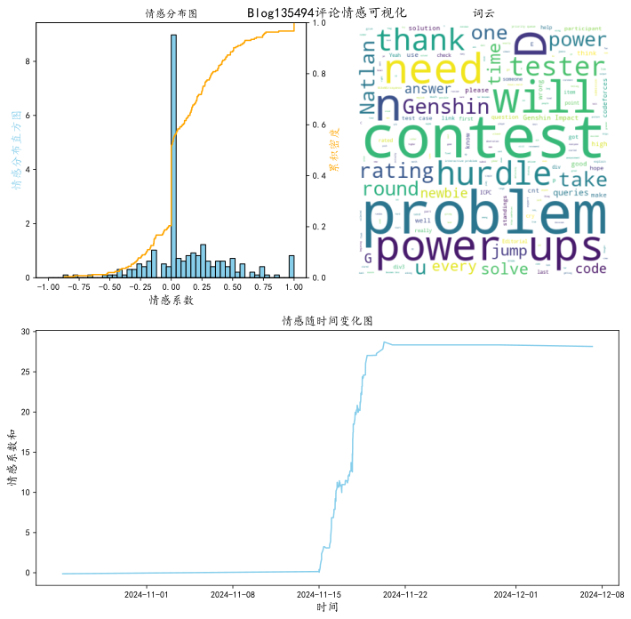

## Codeforces数据可视化


```python
import matplotlib.pyplot as plt
%matplotlib inline
%config InlineBackend.figure_format = 'svg'
```

### Part A:公共数据可视化

##### 1. Codeforces问题集概况可视化


```python
from AllProblemInfoShow import getProData,showAllProblemRatingDis,showInfoProblemLabels
#获取数据
getProData()
```

    问题集数据获取成功
    


```python
#展示问题难度分布
plt.figure(figsize=(10,5))
ax = plt.subplot(111)
showAllProblemRatingDis(ax)
```


    

    


这里我们看到问题难度分布，其中最多的是难度为800的问题，然后其他问题的分布类似于一个二次函数，可以看到中等难度的题目数量较多。


```python
#展示不同问题标签
plt.figure(figsize=(14,5))
ax = plt.subplot(111)
showInfoProblemLabels(ax)
```


    

    


上面的图展示了不同类型问题的数量和平均难度，我们看到数量最多的几种类型math,greedy,implementation，它们的平均难度都不是特别高，而平均难度较高的几种问题，如fft,flows,2-set等的数量不是特别多，所以codeforces上面的题目还是以中等题和简单题为主，难题的数量是远远小于偏简单题的数量。

##### 2.Codeforces全体用户概况可视化


```python
from AllUserInfoShow import getAllUserInfo,showAllUserCountry,showAllUserRatingDist,showTop20HighRating,showTop20MostFriend
#获取数据
getAllUserInfo()#这里暂时不使用因为codeforces获取全部用户的数据的API出问题了，所以我用了我前段时间获取的数据
```

    所有用户数据获取成功
    


```python
#展示用户所属国家
plt.figure(figsize=(14,5))
ax = plt.subplot(111)
showAllUserCountry(ax)
```


    

    


我们可以看到用户最多的几个国家分别是India,Bangladesh,China，用户数量超过1000的国家数只有6个，其他的国家用户数量都比较少。


```python
#展示rating和朋友数量最多的20为用户
fig = plt.figure(figsize=(20,5))
ax = plt.subplot(121)
ax1 = plt.subplot(122)
showTop20HighRating(ax)
showTop20MostFriend(ax1)
fig.savefig("./OutPut/MostRatingAndFriend.svg")
```


    

    


这里可以看到朋友数目最多和rating最高的用户都是tourist，然后不难发现上面两幅图前20的名字有很多的重合，这大概展示了一个趋势：在codeforces上一般rating越高朋友数目越多。


```python
#展示rating分布
plt.figure(figsize=(8,5))
ax = plt.subplot(111)
showAllUserRatingDist(ax)
```


    

    


通过上面这幅图我们发现Rating的分布有点类似于正态分布，但是它0~500这段有一点反常，我认为导致这个的原因是有的人注册账号之后打了一场比赛之后就没打了。然后我们可以发现有80%的用户的rating在1500以下，90%的用户rating在1900以下，在往更高的分数人数越来越少。

### Part B:用户数据可视化

##### 1. 用户基本数据可视化


```python
from UserInfoDisplay import ShowInfo
username = 'Jiangnan111' #需要可视化的用户
ShowInfo(username)
```

    用户Jiangnan111提交数据获取成功
    用户 Jiangnan111 基本数据获取成功
    用户头像获取成功
    用户 Jiangnan111 Rating数据获取成功
    


    

    


这边展示了用户的基本数据，第一幅图展示了用户的名字、头像，目前rating，maxrating，以及一些刷题情况。第二幅图展示了用户刷得最多的五类题目，可以看到Jiangnan111最常刷的题目类型是math和greedy。然后第三幅图展示了该用户的rating变化，蓝色的线是rating，红色的线是用户的排名，可以看到该用户的rating上分曲线类似于一个对数函数。

##### 2. 用户最近提交数据可视化


```python
username = "Jiangnan111"
from UserSubmissionInfo import ShowSubmission
ShowSubmission(username,30)#第二个参数表示展示多久的数据
```

    用户Jiangnan111提交数据获取成功
    用户 Jiangnan111 基本数据获取成功
    用户头像获取成功
    


    

    


这里第一幅图跟前面一样，只是有点小改动。第二幅图是用户这段时间的提交状态，可以看到主要是accepted和wrong answer。然后第三幅图是用户不同类型的题目的提交状态，可以看到该用户提交的题中math，greedy，说明用户最近比较喜欢写这方面的题目。


```python
#多用户rating比较
from MultiUserRatingCom import showAllUserRating
userNameArray = ['Jiangnan111','FXLY_awa','k1nsom']#填入要比较的昵称
showAllUserRating(userNameArray)
```

    用户 Jiangnan111 Rating数据获取完成
    用户 FXLY_awa Rating数据获取完成
    用户 k1nsom Rating数据获取完成
    


    

    


通过上面这幅图我们可以容易看出不同用户rating的变化趋势，同时也可以让我们对多个用户rating进行对比。

### Part C:非用户数据可视化

##### 1. 竞赛Hack数据以及可视化


```python
from showHack import showHackOfContest
showHackOfContest(985)#展示id为985的竞赛的hack数据
```

    Contest 985 hack数据获取成功
    


    

    


上面这幅图，第一幅是hack行为结果统计，可以看到有48.5%的hack行为成功找到了别人代码的漏洞，输入样例有误的hack行为占到了16.2%。第二幅图展示了不同问题的情况，我们可以看到B题，是hack成功最多的题目，那么可以知道很大一部分人在这个问题上有细节没考虑到。第三幅图展示了hack成功数量最多的前30名用户，可以看到昵称叫step_by_step的用户以断层式的数量领先于其他用户。


```python
from showHack import showHackData
#展示用户hack行为
d=showHackData(888)#竞赛id为888的竞赛的hack数据
```

    Contest 888 hack数据获取成功
    

用浏览器打开OutPut中的html文件

##### 2. Codeforces博客评论情感分析可视化


```python
from BlogCommentEmotionAna import commentEmotionAna
#传入博客id，生成可视化图像
commentEmotionAna(135494)
```

    Blog 135494 评论数据获取成功
    


    

    


首先情感系数越靠近1则越是积极评论，越靠近-1则是消极评论。第一幅图是情感系数分布图，我们可以发现大多数评论是中性评论，而剩余的也是主要分布在0的两侧，极端评论较少。第二幅图是评论的词云，可以看到出现最多的有problem,contest等，因为这篇博客是在介绍一场比赛。然后第三幅图是情感随时间的变化，可以看到这篇博客的评论走势还是向着积极的方向移动。
